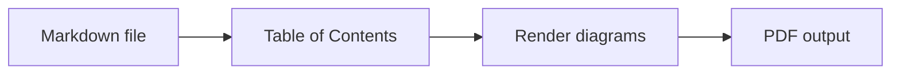

# md2pdf

Convert Markdown files to PDF from any terminal with one command:

```powershell
md2pdf README.md
```

The command shows a compact progress view, refreshes an existing doctoc table of contents on a temporary copy, renders Mermaid diagrams, and writes a PDF next to the Markdown file unless another output directory is configured. Arguments may be single files or whole folders, and `--merge` combines them into one PDF.

## Table of Contents

<!-- START doctoc generated TOC please keep comment here to allow auto update -->
<!-- DON'T EDIT THIS SECTION, INSTEAD RE-RUN doctoc TO UPDATE -->

- [Installation](#installation)
- [Usage](#usage)
- [Options](#options)
- [Uninstall](#uninstall)
- [Additional usage information](#additional-usage-information)
  - [Converting Folders](#converting-folders)
  - [Output Files](#output-files)
  - [Merging Into One PDF](#merging-into-one-pdf)
  - [Personal Stylesheets](#personal-stylesheets)
  - [Manual Page Breaks](#manual-page-breaks)
  - [Page Headers and Footers](#page-headers-and-footers)
  - [Table of Contents Markers](#table-of-contents-markers)
  - [Mermaid Diagram Syntax](#mermaid-diagram-syntax)

<!-- END doctoc generated TOC please keep comment here to allow auto update -->

## Installation

Prerequisites:

- Node.js 22.12 or later

Install the command globally with npm:

```powershell
npm install --global @chrtmnn/md2pdf
```

The `md2pdf` command is then available from any directory, on Windows, macOS and Linux.

The installation downloads a Chromium build for rendering, once. It comes from Puppeteer, a dependency of md-to-pdf and mermaid-cli, whose `postinstall` script stores it in `~/.cache/puppeteer` (`%USERPROFILE%\.cache\puppeteer` on Windows). md2pdf itself has no install script, and once installed, conversions need no network access.

pnpm blocks dependency build scripts, so approve Puppeteer's download after installing with pnpm:

```powershell
pnpm add --global @chrtmnn/md2pdf
pnpm approve-builds --global
```

Releases are published from GitHub Actions with a provenance attestation; the package page on npmjs.com links each version to the commit and the workflow run that built it.

**Upgrading from the PowerShell wrapper**: earlier versions were run from a clone of this repository, installed with `scripts\install.ps1`. Remove that clone's `bin` folder from your user `PATH` (*Edit environment variables for your account*), then install the package as above.

## Usage

Convert one Markdown file:

```powershell
md2pdf README.md
```

Convert multiple files:

```powershell
md2pdf README.md docs\usage.md
```

Convert every `*.md` file of a folder:

```powershell
md2pdf docs
```

Include subfolders:

```powershell
md2pdf -R docs
```

Combine everything into a single PDF named `handbook.pdf`:

```powershell
md2pdf -R --merge handbook docs
```

Combine a folder and one extra file into a single PDF with one table of contents spanning all documents:

```powershell
md2pdf -f --merge handbook docs CHANGELOG.md
```

Write PDFs to an output directory:

```powershell
md2pdf -o pdf README.md
```

Update an existing TOC in the original Markdown file while converting:

```powershell
md2pdf -u README.md
```

Create a TOC on the temporary conversion copy even when the source file has no doctoc markers:

```powershell
md2pdf -f README.md
```

Show help:

```powershell
md2pdf
```

Show output from the underlying conversion tools:

```powershell
md2pdf --verbose README.md
```

Also emit an HTML file next to the PDF for inspection:

```powershell
md2pdf --html README.md
```

Render Mermaid diagrams as PNG instead of SVG:

```powershell
md2pdf --png README.md
```

## Options

`md2pdf [-R] [--merge name] [-s name|path] [--css-var name=value] [-o output_dir] [--title text] [--html] [--toc | --no-toc] [-u] [--png] [--verbose] [--debug] [--keep-temp] [--temp-root dir | --temp-in-output] [files or folders...]`

| option                    | description                                                                                               |
|---------------------------|-----------------------------------------------------------------------------------------------------------|
| `-R, --recursive`            | Also expand subfolders of folder arguments. Skips `node_modules`, `.git`, and folders starting with a dot. |
| `--merge <name>`             | Combine all resolved Markdown files into one PDF with this base name. The `.pdf` suffix is optional.      |
| `-o, --output-dir <dir>`     | Output directory for PDFs. Defaults to each Markdown file's directory, or to the common parent folder of all inputs with `--merge`. |
| `--title <text>`             | Document title for the PDF metadata, instead of the first heading (or the `--merge` name).                |
| `--html`                     | Also write a standalone HTML file next to the PDF using the same stylesheet. An existing HTML file that md2pdf did not generate is never overwritten (see [Output Files](#output-files)). |
| `-s, --stylesheet <name\|path>` | Stylesheet for the generated PDF: a path, or the name of a stylesheet in `~/.md2pdf` (see [Personal Stylesheets](#personal-stylesheets)). `-s default` always means the bundled `default.css`. Without the option, `~/.md2pdf/default.css` is used when it exists, otherwise the bundled stylesheet. Relative `@import` and `url()` references are resolved against the stylesheet's own folder. |
| `--css-var <name=value>`     | Override a CSS custom property for this run. The leading `--` is optional. Repeat for multiple variables. A name the stylesheet never reads with `var()` produces a warning, which usually means a typo. |
| `--toc`                      | Create or refresh a TOC on the temporary conversion copy, even without source TOC markers.                |
| `--no-toc`                   | Never create or refresh a TOC, not even for a file that carries doctoc markers.                           |
| `-u, --write-toc`            | Write the refreshed TOC back into the original Markdown file. Does not create a new source TOC; a file without a marker block gets a warning. Cannot be combined with `--merge`. |
| `--png`                      | Render Mermaid diagrams as PNG instead of SVG. Useful for PDF viewers or downstream tools that handle embedded SVG poorly. |
| `-v, --verbose`              | Print output from doctoc, mermaid-cli, and md-to-pdf while they run, one line per step.                   |
| `--debug`                    | Shorthand for `--html --keep-temp --verbose`.                                                             |
| `--keep-temp`                | Keep the temporary work directories and print their paths, including the one holding the stylesheet that was used. |
| `--temp-root <dir>`          | Root directory for temporary work dirs. Defaults to the system temp directory. Cannot be combined with `--temp-in-output`. |
| `--temp-in-output`           | Place the temporary work dir inside the output directory. Cannot be combined with `--temp-root`.          |
| `-V, --version`              | Print the version number.                                                                                 |
| `-h, --help`                 | Show help.                                                                                                |

Every previous option name still works, so existing scripts keep running: `-f`/`--force-doctoc` for `--toc`, `--update-md-toc` for `--write-toc`, `-k` for `--keep-temp`, `-r` for `--temp-root`, and `-p` for `--temp-in-output`. They are no longer listed in `--help`.

## Uninstall

```powershell
npm uninstall --global @chrtmnn/md2pdf
```

With pnpm, run `pnpm remove --global @chrtmnn/md2pdf` instead. The Chromium download stays in `~/.cache/puppeteer`; delete that folder too if no other tool uses it.

---

<div class="page-break"></div>

## Additional usage information

### Converting Folders

A positional argument may be a Markdown file or a folder. A folder contributes the `*.md` files it contains, at the position where you named it, so `md2pdf intro.md chapters appendix.md` converts `intro.md`, then everything in `chapters`, then `appendix.md`.

- Only the `.md` extension is matched, upper or lower case (`.md`, `.MD`). Other Markdown extensions such as `.markdown` are **not** picked up.
- Files inside one folder are converted in file name order. The comparison is a plain code-point comparison so the order is identical on every machine, which also means names starting with an upper-case letter come first (`README.md` before `readme.md`).
- Pass `-R` to include subfolders. `node_modules`, `.git`, and any folder whose name starts with a dot are skipped, and folder links (symlinks and junctions) are not followed, so a link pointing back at a parent folder cannot cause an endless loop.
- Passing both a folder and a file inside it converts that file once, not twice.
- A folder without any `.md` file produces a warning and is not counted as a failure.
- Files you name directly follow the same extension rule: `md2pdf notes.txt`, or `md2pdf *` in a folder with other files, skips everything that is not `.md` with a warning, and each skipped file counts as a failure. Use `md2pdf .` to convert all Markdown files of a folder.

### Output Files

Each PDF is named after its Markdown file and replaces an existing PDF of that name.

- The PDF is first written to a temporary file next to the target and then swapped in. If writing fails — the old PDF is open in a viewer that locks it, the disk is full — the previous PDF stays as it was.
- If two inputs would produce the same output, for example `md2pdf -R -o pdfs .` over a tree with several `README.md` files, md2pdf lists them and stops **before converting anything**. Convert them in separate runs or into different `-o` folders.
- The `--debug` HTML file carries a `<meta name="generator" content="md2pdf">` tag. An existing HTML file without that tag, such as a hand-written `index.html` next to `index.md`, is not replaced; that document fails instead. HTML files written by md2pdf versions before this check lack the tag too, so delete them once.

### Merging Into One PDF

`--merge <name>` combines every resolved Markdown file into a single PDF:

```powershell
md2pdf -R --merge handbook docs
```

This writes `handbook.pdf`. The `.pdf` suffix is optional, so `--merge handbook.pdf` is equivalent. The name is a file name, not a path; use `-o` to choose the folder. Without `-o` the PDF is written to the common parent folder of all inputs.

Merging happens on the Markdown, before rendering, and the normal conversion then runs once over the combined document. Two consequences are worth knowing:

- All other options still apply. In particular `--toc` produces **one** table of contents spanning every document, which is usually the main reason to merge in the first place.
- Each document starts on a new page. The page break is produced by the `.document-break` helper in the default stylesheet. If you pass your own stylesheet with `-s`, add a matching rule or the documents will run together. To flatten the breaks, use `--css-var document-break-before=auto`.

> **Limitation**: relative **link** targets are not rewritten when documents are merged, so a link written relative to a subfolder may not point anywhere useful in the merged PDF. Relative **image** targets are fine: each one is resolved against its own source document while the documents are concatenated, so two documents in different folders can both use `images/logo.png`. `md2pdf` prints a warning whenever the merged inputs come from more than one folder.

### Personal Stylesheets

Stylesheets you use for many documents can live in a personal config folder, so `-s` finds them by name from any directory:

- Windows: `%USERPROFILE%\.md2pdf`
- macOS/Linux: `~/.md2pdf`

```text
~/.md2pdf/
├── custom.css
└── letter.css
```

```powershell
md2pdf -s custom.css report.md   # uses ~/.md2pdf/custom.css
md2pdf -s letter invite.md       # uses ~/.md2pdf/letter.css, ".css" is optional here
```

`-s` looks in this order:

1. The value as a path, relative to the folder you run `md2pdf` from. A matching file there always wins, and `.css` is never added to it.
2. `~/.md2pdf/<name>`, then `~/.md2pdf/<name>.css`. This only applies to a plain name. `-s ./custom.css` or `-s themes/dark.css` never looks in the config folder, and subfolders of the config folder are not searched.

If nothing matches, the error lists every location that was tried. Set the `MD2PDF_CONFIG_DIR` environment variable to use a different folder.

A `default.css` in the config folder is used whenever you pass no `-s` at all:

```powershell
md2pdf report.md              # uses ~/.md2pdf/default.css when it exists
md2pdf -s default report.md   # uses the bundled default.css for this run
md2pdf -s default.css report.md   # uses ~/.md2pdf/default.css explicitly
```

It **replaces** the bundled stylesheet instead of adding to it, exactly like any other `-s` value, so everything the bundled file provides — the `@page` setup, the `.page-break` and `.document-break` helpers, and all the custom properties `--css-var` targets — has to come from your file. The simplest start is a copy:

```powershell
Copy-Item "$(npm root --global)\@chrtmnn\md2pdf\dist\css\default.css" $HOME\.md2pdf\default.css
```

After installing with pnpm, use `pnpm root --global` in place of `npm root --global`. On macOS and Linux:

```bash
cp "$(npm root --global)/@chrtmnn/md2pdf/dist/css/default.css" ~/.md2pdf/default.css
```

`default` is reserved for the bundled stylesheet, so `-s default` never picks up `~/.md2pdf/default.css`; use `-s default.css` (or its path) for that. `--verbose` prints which stylesheet a run uses and why.

A stylesheet in the config folder may `@import` other files and use `url()` for fonts and images. Relative references resolve against the folder of the file they appear in, including subfolders such as `~/.md2pdf/theme/`. Remote imports such as web fonts may sit anywhere in the file: they are hoisted to the top of the effective stylesheet, keeping the `layer()`, `supports()` and media conditions of the whole import chain, because a browser honours an `@import` only before every other rule.

### Manual Page Breaks

The default stylesheet exposes a `.page-break` helper that forces a page break before the element it is applied to. Insert an empty HTML element with the class wherever the next page should start — any of these work:

```markdown
<i class="page-break"></i>
<span class="page-break"></span>
<div class="page-break"></div>
```

The helper sets `display: block` internally, so inline elements work too. The marker is invisible in the rendered PDF and is ignored by Markdown viewers that do not honour the class.

### Page Headers and Footers

The default stylesheet fills the six `@page` margin boxes from custom properties, so a running header or footer needs no change to the stylesheet itself — only `--css-var`:

| Variable | Default |
|---|---|
| `--page-top-left-content` | `unset` |
| `--page-top-center-content` | `unset` |
| `--page-top-right-content` | `unset` |
| `--page-bottom-left-content` | `unset` |
| `--page-bottom-center-content` | `counter(page) "/" counter(pages)` |
| `--page-bottom-right-content` | `unset` |

Every page therefore carries a centred page-of-total footer such as `2/7`, and the remaining five boxes stay empty until they are given content.

```powershell
md2pdf --css-var page-top-right-content='"Internal draft"' report.md
md2pdf --css-var page-bottom-center-content='"Page " counter(page)' report.md
md2pdf --css-var page-bottom-center-content=unset report.md   # no page numbers
```

Each value is a CSS `content` value, not plain text, which has two consequences:

- **Literal text has to be quoted.** `page-top-right-content=Draft` is not a valid `content` value, so the box renders empty and nothing warns about it — the variable *is* read by the stylesheet, so the unused-variable check stays quiet. Quote it as `'"Draft"'` in PowerShell and bash alike.
- `counter(page)` and `counter(pages)` give the current page and the page total, and concatenate with quoted strings by writing them next to each other, as in the second example above.

Box content renders at 9pt in `--color-muted`, inside the page margin set by `--page-margin-top` and `--page-margin-bottom`. A custom stylesheet passed with `-s` replaces the bundled one entirely (see [Personal Stylesheets](#personal-stylesheets)), so it needs its own `@page` margin box rules for any of this to apply.

### Table of Contents Markers

`md2pdf` refreshes a TOC automatically when the source Markdown contains a doctoc marker block. Add the following block once at the location where the TOC should appear:

```markdown
<!-- START doctoc generated TOC please keep comment here to allow auto update -->
<!-- END doctoc generated TOC please keep comment here to allow auto update -->
```

On the next conversion, doctoc fills the block with the current heading structure. Subsequent runs keep the block in place and update its content.

Only a marker block written on its own lines counts. Markers that merely appear as examples, inside a code block or in inline code like the one above, are ignored and stay intact. If a file has a START marker without a matching END marker after it, the conversion of that file fails with an error and the file is left untouched. Otherwise doctoc would replace everything after the START marker.

If the source Markdown does not yet contain the marker block, pass `-f` once to let doctoc create it on the temporary conversion copy. The newly created block is then placed directly before the first second-order (`##`) heading in the file, regardless of where doctoc itself would otherwise have inserted it.

To also write the refreshed TOC back into the original Markdown file (instead of only into the temporary conversion copy), combine `-u` with an existing marker block. `-u` never adds a marker block to the source file: on a file without one it leaves the file unchanged and prints a warning. `-u` cannot be combined with `--merge`, because a merged run converts a temporary combined copy of the files, not the files themselves.

### Mermaid Diagram Syntax

Mermaid code fences are rendered automatically during conversion.

Diagrams render to SVG by default. Pass `--png` to render them as PNG instead, at a 3x scale for print resolution. SVG is a good default because it stays crisp at any zoom level, but choose `--png` if the target PDF viewer or a downstream tool handles embedded SVG poorly.

> For further information visit https://mermaid.js.org/intro/syntax-reference.html.

**Markdown input**:

<pre><code>```mermaid
flowchart LR
  A[Markdown file] --> B[Table of Contents]
  B --> C[Render diagrams]
  C --> D[PDF output]
```</code></pre>

**Rendered preview**:


